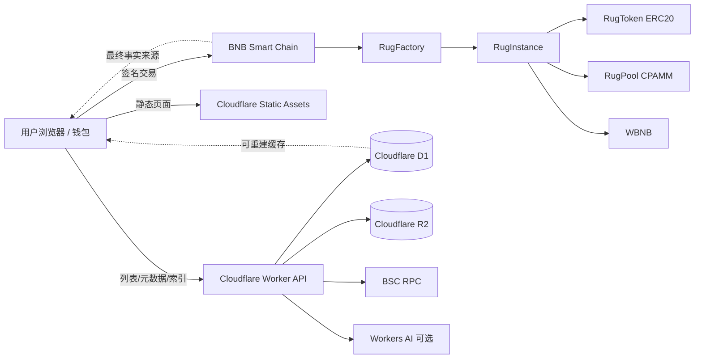
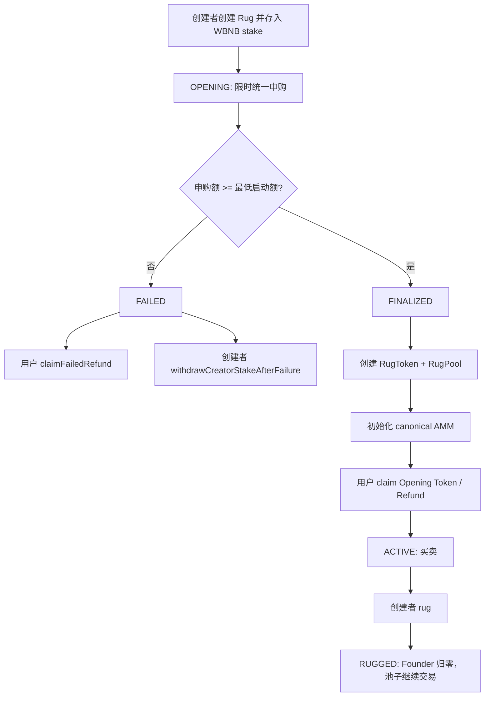

# Rugspull BSC 技术开发规格书

**版本：** v0.4（BSC-first Testnet Release Candidate；为兼容仓库规则保留 v0.3 文件名）
**日期：** 2026-07-13
**目标读者：** 产品负责人、Solidity/Foundry 开发者、前端开发者、Cloudflare Workers 开发者、审计人员、Codex
**默认链：** BNB Smart Chain / BSC
**默认报价资产：** WBNB
**默认池模型：** Rugspull 内置 Uniswap V2-style canonical AMM；不在 MVP 中依赖外部 PancakeSwap 池
**部署目标：** Cloudflare 免费方案承载 Web 与索引缓存；全部资金逻辑在 BSC 智能合约中完成

---

## 0. 文档结论

本版本将 Rugspull 的 MVP 改为 **BSC-first**。不实现 Solana、Anchor、Raydium、PDA、SPL Token 或其他非 EVM 路线。

Rugspull 的核心不是做一个新的复杂链上游戏，而是保留用户已经熟悉的 DEX 买卖方式，只改造传统垃圾项目中最不公平的权限：

1. 创建者不能抽 LP。
2. 创建者不能拿到可自由转账的 Founder Token。
3. Founder Allocation 只能由协议一次性、全量卖回唯一官方池。
4. 初始购买采用限时统一申购，降低 bot 抢第一口的优势。
5. 如果启动失败，不建立 LP，用户退款，创建者取回启动资金。
6. 一旦启动成功，池子不可逆，创建者不能撤销或取回初始流动性。

一句话定义：

> Rugspull 是一个公开承认创建者最终可以一次性砸盘、但创建者必须先承担初始资金风险且无法抽走 LP 的 DEX-like 发行协议。

### v0.4 固定经济参数

```text
Founder Allocation: 45%
Opening: 24 hours
Founder unlock delay: 48 hours after Opening ends
Minimum launch: 30% of creator stake
Accepted contribution cap: 50% of creator stake
Minimum creator stake: 0.1 WBNB
Creation fee: 0.003 WBNB
Nominal trading fee: 0.30% total
  - pool fee: 0.25%, retained in RugPool
  - protocol fee: 0.05%, paid in WBNB to protocolTreasury
```

这些参数在每个 Factory 中不可变；既有 Rug 不允许被管理员修改。创建者是否执行 Rug 没有强制期限，Rugged 后 canonical pool 继续交易。

---

## 0.1 为什么 BSC-first

BSC 版本的主要优势是工程确定性。

BNB Smart Chain 与 EVM 兼容，Ethereum 项目可使用 Solidity、MetaMask、Foundry、OpenZeppelin 等成熟工具迁移或开发。BSC 当前官方文档也强调低费用、快区块和 EVM 兼容性；截至本文档撰写时，BSC 文档列出的标准 gas price 为 0.05 Gwei，典型交易费约 0.005 美元或更低，区块时间约 0.45 秒。

本 MVP 需要重点验证经济机制，而不是一开始进入高复杂度跨程序调用。因此本版本选择：

- Solidity + Foundry；
- OpenZeppelin Contracts；
- BSC Testnet / BSC Mainnet；
- WBNB 作为唯一 v0 报价资产；
- 内置 canonical AMM，避免外部 PancakeSwap 池创建、预创建、捐赠、sync、路由差异带来的复杂性；
- 后续 v1 再考虑 PancakeSwap v2/v3/Infinity 路由适配。

---

## 0.2 PancakeSwap 集成为什么不是 MVP 默认

BSC 上最自然的 DEX 心智是 PancakeSwap。PancakeSwap 官方文档显示其 v2 factory 与 router 在 BSC 主网上分别有固定地址：

```text
PancakeSwap v2 Factory / BSC:
0xcA143Ce32Fe78f1f7019d7d551a6402fC5350c73

PancakeSwap v2 Router / BSC:
0x10ED43C718714eb63d5aA57B78B54704E256024E
```

但是，Rugspull 的公平开盘要求满足一个很强的不变量：

```text
Opening 统一申购价 ≈ 正式池初始现货价
```

如果 MVP 直接依赖外部 PancakeSwap pair，会遇到额外攻击面和实现复杂度：

- pair 地址可预测时，外部用户可能提前创建空 pair；
- 外部用户可能向 pair 捐赠 WBNB 或调用 `sync()`，破坏初始储备假设；
- router/addLiquidity 行为、fee-on-transfer 支持、已存在 pair、MINIMUM_LIQUIDITY 等细节都会进入核心安全边界；
- MVP 的 canonical pool 必须服务于 Founder 一次性卖回规则，而不是让流动性分散到多个外部池。

因此 v0 选择内置常数乘积池：

```text
RugPool: token reserve × WBNB reserve = k
```

这仍然是 DEX-like 玩法：用户买、卖、看价格、承受滑点；只是 canonical liquidity 不通过外部 LP token 表示，从根上不存在“创建者抽 LP”的路径。

后续 v1 可以增加：

- PancakeSwap adapter；
- aggregator route discovery；
- 将 canonical pool 交易量导出到外部索引器；
- 在机制验证后迁移/桥接到 PancakeSwap pair。

MVP 禁止 Codex 自行把核心池换成 PancakeSwap。

---

## 0.3 工具链基线

Codex 首次实现时固定以下基线：

```text
Solidity: ^0.8.24
Foundry: forge/cast/anvil, repository-pinned via foundry.toml
OpenZeppelin Contracts: 5.x tagged release
Chain: BSC Testnet first, BSC Mainnet later
Quote asset: WBNB only
Frontend: React + TypeScript + Vite
Wallet: wagmi + viem, BSC chain config
Web runtime: Cloudflare Workers Static Assets + Worker API
Database/cache: Cloudflare D1
Object storage: Cloudflare R2
Bot protection: Cloudflare Turnstile for metadata/upload APIs only
AI: Workers AI optional, disabled by default
```

版本升级原则：

- 不要在同一 PR 中同时升级 Solidity、OpenZeppelin、wagmi/viem 和经济公式。
- 不要将合约设置为可升级代理，除非另起协议版本并重新审计。
- 不要在 v0 支持任意 quote token；WBNB 是唯一允许报价资产。
- 不要加入 transfer tax、blacklist、whitelist、freeze、rebasing、reflection 或动态手续费 token。

---

## 1. 产品边界

### 1.1 产品目标

- 用户用熟悉的 `Buy / Sell` 方式参与。
- 创建者需要先投入真实资金。
- 初始购买阶段采用统一申购，降低抢跑优势。
- 启动失败时，用户和创建者都可以取回资金。
- 启动成功后，初始流动性不可撤回。
- Founder Allocation 不能转账，不能 OTC，不能作为 LP，不能分批卖出。
- Founder Allocation 的唯一出口是 `rug(minOut, deadline)`。
- `rug()` 一次性全量卖回 canonical pool，之后 Founder Allocation 归零。
- Cloudflare 和 D1 不能作为余额、价格或结算的最终来源。

### 1.2 非目标

MVP 不实现：

- 复杂游戏规则、投票、随机奖励、心理指数；
- AI 参与价格、清算、概率、胜负判断；
- 创建者分批卖出；
- 创建者抽 LP；
- 外部 PancakeSwap 池作为核心池；
- 任意 ERC20 报价资产；
- 税费 token / 黑名单 token / rebasing token；
- 自动强制 Rug；
- 平台托管用户私钥；
- 后端代签经济交易；
- 服务端数据库作为账本真相；
- 通过每钱包限额假装解决女巫攻击。

### 1.3 必须展示给用户的信息

每个 Rug 页面必须显示：

- 创建者投入金额；
- Opening 开始和结束时间；
- 最低启动金额；
- Opening cap；
- 用户总申购额；
- 当前状态：Opening / Failed / Active / Rugged；
- Founder Allocation 比例；
- 0.30% 名义总交易费及 0.25% 留池 / 0.05% 协议金库拆分；
- Founder 是否已经 Rug；
- 如果创建者现在 Rug，估算可拿多少 WBNB；
- 初始池是否不可撤回；
- 本 token 不代表股权、债权、收益权、路线图或任何项目承诺；
- 结构上允许创建者最终执行一次公开砸盘。

前端不能使用“安全”“公平保证”“不会 rug”等措辞。

---

## 2. 总体架构



### 2.1 信任模型

| 组件 | 是否可信 | 说明 |
|---|---:|---|
| RugFactory | 必须可信 | 创建 Rug、保存全局参数、发出索引事件 |
| RugInstance | 必须可信 | Opening、退款、Claim、finalize、rug 状态机 |
| RugPool | 必须可信 | canonical AMM，持有不可撤回流动性 |
| RugToken | 必须可信 | 普通 ERC20，固定供应量，无 owner mint |
| WBNB | 外部依赖 | BSC 标准 WBNB；v0 唯一报价资产 |
| Cloudflare Worker | 不可信展示/索引层 | 不持有资金，不决定链上状态 |
| D1 | 不可信缓存 | 可清空重建，不是账本 |
| R2 | 内容存储 | metadata/image 由哈希校验 |
| RPC | 可用性依赖 | 不应成为资金安全依赖 |
| 前端 | 不可信 | 所有关键参数由合约重新校验 |

### 2.2 最重要的架构原则

1. **链上是真相，Cloudflare 是缓存。**
2. **用户和创建者直接签名交易，Worker 不托管资产。**
3. **失败发行不建立流动性。**
4. **成功发行后流动性没有 withdraw 函数。**
5. **Founder Token 不进创建者钱包。**
6. **Founder 只能一次性卖回 canonical pool。**
7. **AI 和索引器失败不影响退款、Claim、交易或 Rug。**

---

## 3. 用户流程与状态机

### 3.1 用户可见流程



### 3.2 链上状态枚举

```solidity
enum RugStatus {
    Opening,
    Failed,
    Active,
    Rugged
}
```

允许状态迁移：

```text
Opening -> Failed
Opening -> Active
Active  -> Rugged
```

禁止状态迁移：

```text
Opening -> Cancelled by creator after seeing demand
Failed  -> Active
Active  -> Failed
Rugged  -> Active
Rugged  -> Rugged again
```

### 3.3 创建者流程

1. 创建者在前端填写：名称、symbol、图片、主题、描述、风险披露确认。
2. 前端将 metadata JSON 和图片上传到 R2。
3. Worker 返回 metadata URI、image URI、metadata hash。
4. 创建者调用 `RugFactory.createRug(params)` 并转入 `creatorStake` WBNB。
5. Rug 进入 Opening。
6. Opening 结束后，任何人可调用 `finalize()`。
7. 若失败，创建者调用 `withdrawCreatorStakeAfterFailure()`。
8. 若成功，创建者等待 `founderUnlockTime` 后，可调用 `rug(minQuoteOut, deadline)`。

创建者在 Opening 开始后不能取消；只能等待系统按规则成功或失败。

### 3.4 用户流程

1. 用户在 Opening 期间调用 `contribute(amount)`。
2. Opening 期间不会即时成交，也没有价格曲线。
3. Opening 结束后：
   - 失败：用户调用 `claimFailedRefund()` 取回全部 WBNB；
   - 成功：用户调用 `claimOpening()` 领取 token 和超额退款。
4. Active 后，用户通过 RugPool 买卖：
   - `buyExactQuoteForTokens(amountIn, minTokensOut, deadline)`；
   - `sellExactTokensForQuote(amountIn, minQuoteOut, deadline)`。
5. Rugged 后，Founder Allocation 已被卖完，但 canonical pool 继续存在，用户仍可交易。

---

## 4. 经济模型

### 4.1 符号定义

```text
T = token total supply
f = founder allocation bps, v0.4 固定为 4500 = 45%
F = floor(T * f / 10000)
N = T - F

C = creator stake in WBNB
U = total user contributions in WBNB
M = minimum launch amount
Cap = opening accepted contribution cap
Q = min(U, Cap)

A = opening user token allocation
X = canonical pool token reserve
Y = canonical pool WBNB reserve
```

启动条件：

```text
U >= M
```

如果不满足：

```text
status = Failed
用户全额退款
创建者取回 C
不创建池子
```

如果满足：

```text
Q = min(U, Cap)
Y = C + Q
```

### 4.2 Opening 价格与池子初始价格

目标不变量：

```text
Opening 用户统一购买价格 >= canonical pool 初始现货价格
```

原因：

- 如果 Opening 用户价格低于开池现货价，会出现机械性无风险抢卖；
- 如果完全相等，最好；
- 由于整数除法，允许 Opening 用户价格略高于现货价，这会消除即时套利空间。

计算公式：

```text
A = floor(N * Q / (C + 2Q))
X = N - A
Y = C + Q
```

开盘用户价格：

```text
P_opening = Q / A
```

池子初始现货价：

```text
P_pool = Y / X
```

忽略整数舍入时：

```text
P_opening = P_pool = (C + 2Q) / N
```

使用 `floor` 计算 `A` 后：

```text
P_opening >= P_pool
```

Codex 必须先在 TypeScript 和 Solidity 中实现相同公式，并做 fuzz/property tests。

### 4.3 Opening 用户分配公式

用户 `i` 的贡献：

```text
u_i
```

超额退款总额：

```text
E = U - Q
```

用户领取 token：

```text
token_i = floor(A * u_i / U)
```

用户退款：

```text
refund_i = floor(E * u_i / U)
```

注意：

- 不使用先到先得；
- 不因第一个区块提交而获得更低价格；
- 每钱包限额不是安全前提；
- 女巫攻击无法彻底解决，统一申购只解决速度公平。

### 4.4 Founder Allocation

Founder Allocation：

```text
F = floor(T * founderBps / 10000)
```

约束：

- `F` 不转给创建者；
- `F` 保存在 RugInstance；
- `F` 不能 approve 给创建者；
- `F` 不能被分批卖出；
- `F` 只能通过 `rug()` 一次性卖入 RugPool；
- `rug()` 成功后 `founderRemaining = 0`。

### 4.5 创建者为什么不必一开始确定亏损

如果 Opening 失败：

```text
用户退款
创建者取回 C
```

这避免了“无人购买也永久亏损”的问题。

如果 Opening 成功：

```text
创建者资金 C 与被接受申购 Q 进入 canonical pool
Founder Bag 激活
```

此时创建者无法再撤回 C，只能通过一次性 Rug 卖出 F 获利或亏损。

### 4.6 创建者为什么仍然可能亏损

创建者在 Active 后执行：

```text
rug() = sell all F into RugPool
```

若池中 WBNB 不足、用户已经提前卖出、价格下跌或创建者过早砸盘，`rug()` 的输出可能低于 `creatorStake`。

创建者的 PnL 可近似理解为：

```text
creator_pnl = quote_out_from_rug - C
```

不加入额外心理公式，不由服务器判断用户情绪。

### 4.7 AMM 交易公式

RugPool 使用常数乘积模型：

```text
reserveToken * reserveQuote = k
```

设池内费与协议费：

```text
swapFeeBps = 25       // 0.25%，留在池中
protocolFeeBps = 5    // 0.05%，以 WBNB 转入 protocolTreasury
FEE_DENOM = 10000
```

买入 token：

```text
protocolFeeQuote = floor(quoteIn * protocolFeeBps / FEE_DENOM)
poolQuoteIn = quoteIn - protocolFeeQuote
quoteInAfterPoolFee = floor(poolQuoteIn * (FEE_DENOM - swapFeeBps) / FEE_DENOM)
tokensOut = floor(reserveToken * quoteInAfterPoolFee / (reserveQuote + quoteInAfterPoolFee))
reserveQuote += poolQuoteIn
```

卖出 token：

```text
tokenInAfterFee = tokenIn * (FEE_DENOM - swapFeeBps) / FEE_DENOM
grossQuoteOut = floor(reserveQuote * tokenInAfterFee / (reserveToken + tokenInAfterFee))
protocolFeeQuote = floor(grossQuoteOut * protocolFeeBps / FEE_DENOM)
quoteOut = grossQuoteOut - protocolFeeQuote
reserveQuote -= grossQuoteOut
```

Founder 的 `rug()` 使用同一卖出路径并缴纳协议费。每次 swap 后更新 reserves；小额交易的协议费可能因整数除法向下舍入为 0。上述两层费按顺序计算，因此“0.30%”是名义费率，实际有效费率可能因顺序、价格影响和舍入略低。

### 4.8 费用策略

v0.4 固定：

```text
creationFee: 0.003 WBNB, sent to protocol treasury
swapFeeBps: 25 bps, retained in pool reserves
creatorFee: 0 in MVP
protocolFeeBps: 5 bps, collected in WBNB by protocol treasury
```

不引入 creator trading fee。原因：

- 会激励刷量；
- 会让经济模型更难验证；
- 会让创建者出现靠交易费保本的复杂路径。

协议交易费适用于 buy、sell 和 Founder rug；Opening contribution、claim 与失败退款不收交易费。任何后续费率变化必须部署新 Factory，不得修改既有 Rug。

---

## 5. 智能合约架构

### 5.1 合约列表

```text
contracts/
├── RugFactory.sol
├── RugInstance.sol
├── RugToken.sol
├── RugPool.sol
├── interfaces/
│   ├── IWBNB.sol
│   ├── IRugFactory.sol
│   ├── IRugInstance.sol
│   └── IRugPool.sol
├── libraries/
│   ├── RugMath.sol
│   └── TransferLib.sol
└── test/
```

### 5.2 RugFactory

职责：

- 保存全局不可变配置；
- 创建 RugInstance；
- 收取 creationFee；
- 记录协议版本；
- 发出 `RugCreated` 事件；
- 可暂停新建 Rug，但不得暂停既有 Rug 的退款、claim、buy、sell、rug。

关键状态：

```solidity
contract RugFactory {
    address public immutable WBNB;
    address public immutable protocolTreasury;
    uint16 public immutable founderBps;
    uint16 public immutable swapFeeBps;
    uint16 public immutable protocolFeeBps;
    uint16 public immutable minLaunchBps;
    uint16 public immutable openingCapBps;
    uint40 public immutable openingDuration;
    uint40 public immutable founderUnlockDelay;
    uint256 public immutable creationFee;
    uint256 public immutable minCreatorStake;
    uint256 public immutable tokenTotalSupply;

    address public owner;
    address public pendingOwner;
    bool public createPaused;
    address[] public allRugs;
}
```

权限：

- `owner` 可以暂停/恢复 **新建 Rug**；
- `owner` 不能修改已创建 Rug 的经济参数；
- `owner` 不能取走 RugInstance 或 RugPool 中资金；
- `owner` 不能替创建者 rug；
- `owner` 不能冻结用户交易。

建议使用不可升级合约。新版本通过部署新的 RugFactory 迭代。

构造配置必须拒绝会使新 Rug 永久无法 finalize 的参数：

- `WBNB` 必须是有代码的合约地址；
- `founderBps < 10000`；
- `swapFeeBps + protocolFeeBps <= 1000`；
- `0 < minLaunchBps <= 10000`；
- `0 < openingCapBps <= 10000`；
- `minLaunchBps <= openingCapBps`；
- `minCreatorStake > 0`，且最低 stake 推导出的最低启动额与 cap 都必须非零；
- `tokenTotalSupply <= type(uint112).max`，确保 canonical pool 储备可表示；
- `block.timestamp + openingDuration + founderUnlockDelay <= type(uint40).max`；
- `createRug` 必须拒绝 `creatorStake + openingCap` 超过 `uint112` 的输入，避免成功发行永久卡在 pool 初始化；
- 部署脚本在缩窄到 `uint16` / `uint40` 前必须检查范围，禁止静默截断。

### 5.3 RugInstance

每个 Rug 一个 RugInstance。

职责：

- 接收创建者 stake；
- 接收用户 Opening contribution；
- 记录贡献；
- finalize 成功或失败；
- 部署 RugToken 和 RugPool；
- 保存 Founder Allocation；
- 处理 Opening claim/refund；
- 执行一次性 rug。

关键状态：

```solidity
contract RugInstance {
    enum RugStatus { Opening, Failed, Active, Rugged }

    address public immutable factory;
    address public immutable creator;
    address public immutable WBNB;
    address public immutable protocolTreasury;

    RugStatus public status;

    uint256 public immutable creatorStake;
    uint256 public immutable minLaunchAmount;
    uint256 public immutable openingCap;
    uint40  public immutable openingStart;
    uint40  public immutable openingEnd;
    uint40  public immutable founderUnlockTime;
    uint16  public immutable swapFeeBps;
    uint16  public immutable protocolFeeBps;

    uint256 public totalContributed;
    mapping(address => uint256) public contributionOf;
    mapping(address => bool) public claimed;

    address public token;
    address public pool;

    uint256 public acceptedContribution; // Q
    uint256 public openingTokenAllocation; // A
    uint256 public poolTokenReserve; // X
    uint256 public poolQuoteReserve; // Y
    uint256 public founderRemaining; // F until rug, then 0

    bytes32 public metadataHash;
    string public metadataURI;
    bytes32 public disclosureHash;
}
```

### 5.4 RugToken

普通 ERC20。

要求：

- fixed supply；
- constructor 一次性 mint 到 RugInstance；
- 无 owner mint；
- 无 blacklist；
- 无 freeze；
- 无 tax；
- 无 rebasing；
- 无 transfer hook；
- decimals = 18。

示例：

```solidity
contract RugToken is ERC20 {
    constructor(
        string memory name_,
        string memory symbol_,
        address initialHolder,
        uint256 totalSupply_
    ) ERC20(name_, symbol_) {
        _mint(initialHolder, totalSupply_);
    }
}
```

### 5.5 RugPool

RugPool 是 canonical AMM。

职责：

- 持有 RugToken 与 WBNB 储备；
- 提供买卖接口；
- 保存 reserves；
- 无 LP token；
- 无 withdrawLiquidity；
- 只在初始化时接受初始储备；
- 交易后根据常数乘积公式更新 reserves。

关键状态：

```solidity
contract RugPool {
    address public immutable token;
    address public immutable WBNB;
    address public immutable rugInstance;
    address public immutable protocolTreasury;

    uint112 public reserveToken;
    uint112 public reserveQuote;
    uint16 public immutable swapFeeBps;
    uint16 public immutable protocolFeeBps;
    bool public initialized;
}
```

权限：

- `initialize()` 只能由 RugInstance 调用一次；
- buy/sell 对所有人开放；
- 没有任何函数可以提走储备；
- 没有 owner 权限；
- 没有 admin pause。

### 5.6 为什么 RugPool 不发行 LP Token

因为产品目标就是“创建者无法抽 LP”。

如果使用传统 Uniswap/Pancake LP token，需要处理：

- LP token 归属；
- burn 地址；
- locker 合约；
- 第三方 pair 预创建；
- pair donation / sync；
- router 行为差异。

MVP 内置 RugPool 直接持有储备，不发行 LP token，从设计上不存在 remove liquidity。

这牺牲了 PancakeSwap 直接路由，但大幅降低 v0 的漏洞面。

---

## 6. 合约函数规格

### 6.1 RugFactory.createRug

```solidity
function createRug(CreateRugParams calldata params) external returns (address rug);
```

`params`：

```solidity
struct CreateRugParams {
    string name;
    string symbol;
    string metadataURI;
    bytes32 metadataHash;
    uint256 creatorStake;
}
```

流程：

1. 检查 `!createPaused`。
2. 检查 `creatorStake >= minCreatorStake`。
3. 从创建者转入 `creatorStake + creationFee` WBNB。
4. creationFee 转给 treasury。
5. 部署 RugInstance。
6. RugInstance 持有 creatorStake。
7. Factory 写入固定的 `DISCLOSURE_HASH`；调用者不能自选或弱化风险披露。
8. 发出 `RugCreated` 事件。

注意：

- UI 可以提供 `createRugWithBNB()` 包装函数，但核心协议使用 WBNB。
- 创建者必须先 approve WBNB，或前端引导 wrap BNB。

### 6.2 RugInstance.contribute

```solidity
function contribute(uint256 amount) external nonReentrant;
```

流程：

1. `status == Opening`。
2. `block.timestamp < openingEnd`。
3. `amount > 0`。
4. 从用户转入 WBNB。
5. `contributionOf[msg.sender] += amount`。
6. `totalContributed += amount`。
7. 发出 `Contributed`。

允许同一用户多次 contribute。

### 6.3 RugInstance.finalize

```solidity
function finalize() external nonReentrant;
```

任何人可调用。

流程：

1. `status == Opening`。
2. `block.timestamp >= openingEnd`。
3. 若 `totalContributed < minLaunchAmount`：
   - `status = Failed`；
   - 发出 `LaunchFailed`；
   - 返回。
4. 若成功：
   - 计算 `Q, F, N, A, X, Y`；
   - 部署 RugToken；
   - 部署 RugPool；
   - 将 `X` RugToken 与 `Y` WBNB 转入 RugPool；
   - 调用 `pool.initialize(X, Y)`；
   - 保存 `founderRemaining = F`；
   - 保存 `openingTokenAllocation = A`；
   - `status = Active`；
   - 发出 `LaunchSucceeded`。

重要：

- `RugInstance` 最初持有全部 `T` token；
- 转入 pool：`X`；
- 留给 Opening claim：`A`；
- 留作 Founder：`F`；
- 必须满足 `A + X + F == T`。

### 6.4 RugInstance.claimOpening

```solidity
function claimOpening() external nonReentrant;
```

适用于成功发行。

流程：

1. `status == Active || status == Rugged`。
2. `!claimed[msg.sender]`。
3. `u = contributionOf[msg.sender]`。
4. `u > 0`。
5. `claimed[msg.sender] = true`。
6. 计算：

```text
tokenAmount = floor(openingTokenAllocation * u / totalContributed)
refundAmount = floor((totalContributed - acceptedContribution) * u / totalContributed)
```

7. 转出 RugToken 和 WBNB。
8. 发出 `ClaimedOpening`。

### 6.5 RugInstance.claimFailedRefund

```solidity
function claimFailedRefund() external nonReentrant;
```

适用于失败发行。

流程：

1. `status == Failed`。
2. `!claimed[msg.sender]`。
3. `amount = contributionOf[msg.sender]`。
4. `claimed[msg.sender] = true`。
5. 转回 WBNB。
6. 发出 `ClaimedFailedRefund`。

### 6.6 RugInstance.withdrawCreatorStakeAfterFailure

```solidity
function withdrawCreatorStakeAfterFailure() external nonReentrant;
```

流程：

1. `msg.sender == creator`。
2. `status == Failed`。
3. 尚未取回。
4. 转回 creatorStake WBNB。
5. 发出 `CreatorStakeWithdrawn`。

### 6.7 RugPool.buyExactQuoteForTokens

```solidity
function buyExactQuoteForTokens(
    uint256 quoteIn,
    uint256 minTokensOut,
    address to,
    uint256 deadline
) external nonReentrant returns (uint256 tokensOut);
```

流程：

1. 检查 deadline。
2. 从调用者转入 WBNB。
3. 计算 tokensOut。
4. 检查 `tokensOut >= minTokensOut`。
5. 更新 reserves。
6. 转出 RugToken 给 `to`。
7. 发出 `Swap`。

### 6.8 RugPool.sellExactTokensForQuote

```solidity
function sellExactTokensForQuote(
    uint256 tokenIn,
    uint256 minQuoteOut,
    address to,
    uint256 deadline
) external nonReentrant returns (uint256 quoteOut);
```

流程：

1. 检查 deadline。
2. 从调用者转入 RugToken。
3. 计算 quoteOut。
4. 检查 `quoteOut >= minQuoteOut`。
5. 更新 reserves。
6. 转出 WBNB 给 `to`。
7. 发出 `Swap`。

### 6.9 RugInstance.rug

```solidity
function rug(uint256 minQuoteOut, uint256 deadline) external nonReentrant returns (uint256 quoteOut);
```

流程：

1. `msg.sender == creator`。
2. `status == Active`。
3. `block.timestamp >= founderUnlockTime`。
4. `founderRemaining > 0`。
5. `amount = founderRemaining`。
6. `founderRemaining = 0`。
7. 将 `amount` RugToken approve/transfer 给 RugPool。
8. 调用 pool 的内部卖出路径。
9. 检查 `quoteOut >= minQuoteOut`。
10. 从 gross WBNB output 扣除 5 bps 协议费并转给 protocolTreasury。
11. 净 WBNB 转给 creator。
12. `status = Rugged`。
13. 发出 `RugPulled`。

注意：如果任一步 revert，整笔交易回滚，`founderRemaining` 仍然不变。

---

## 7. 事件规格

```solidity
event RugCreated(
    address indexed rug,
    address indexed creator,
    string name,
    string symbol,
    uint256 creatorStake,
    uint40 openingEnd,
    bytes32 metadataHash,
    bytes32 disclosureHash
);

event Contributed(address indexed rug, address indexed user, uint256 amount);

event LaunchFailed(address indexed rug, uint256 totalContributed, uint256 minLaunchAmount);

event LaunchSucceeded(
    address indexed rug,
    address indexed token,
    address indexed pool,
    uint256 totalContributed,
    uint256 acceptedContribution,
    uint256 openingTokenAllocation,
    uint256 poolTokenReserve,
    uint256 poolQuoteReserve,
    uint256 founderAllocation
);

event ClaimedOpening(address indexed rug, address indexed user, uint256 tokenAmount, uint256 refundAmount);

event ClaimedFailedRefund(address indexed rug, address indexed user, uint256 amount);

event CreatorStakeWithdrawn(address indexed rug, address indexed creator, uint256 amount);

event Swap(
    address indexed pool,
    address indexed sender,
    address indexed to,
    bool quoteToToken,
    uint256 amountIn,
    uint256 amountOut,
    uint112 reserveToken,
    uint112 reserveQuote
);

event RugPulled(address indexed rug, address indexed creator, uint256 founderTokensSold, uint256 quoteOut);
```

Cloudflare 索引器只依赖事件和链上 `view` 函数重建列表。

---

## 8. 数学库与测试要求

### 8.1 RugMath.sol

必须提供：

```solidity
function founderAllocation(uint256 totalSupply, uint16 founderBps) internal pure returns (uint256);

function openingAccepted(uint256 totalContributed, uint256 openingCap) internal pure returns (uint256);

function openingTokenAllocation(
    uint256 nonFounderSupply,
    uint256 creatorStake,
    uint256 acceptedContribution
) internal pure returns (uint256);

function getAmountOut(
    uint256 amountIn,
    uint256 reserveIn,
    uint256 reserveOut,
    uint16 feeBps
) internal pure returns (uint256);
```

### 8.2 TypeScript 对照实现

`packages/economics/src/index.ts` 必须实现同样公式，供前端和测试使用。

### 8.3 必须测试的不变量

Opening 成功时：

```text
F + A + X == T
Y == C + Q
Q <= U
Q <= Cap
U >= M
A > 0
X > 0
Y > 0
P_opening >= P_pool
```

用户 claim：

```text
sum(token_i) <= A
sum(refund_i) <= U - Q
每个用户最多 claim 一次
失败发行用户可取回全额贡献
失败发行创建者可取回 creatorStake
```

Rug：

```text
rug 之前 founderRemaining == F
rug 成功后 founderRemaining == 0
rug 成功后 status == Rugged
rug 不能重复执行
rug 输出遵守 AMM getAmountOut
creator 不能直接转走 Founder Token
creator 不能抽取 pool reserves
```

AMM：

```text
swap 后 reserveToken 和 reserveQuote 与实际余额一致
canonical swap 后 k 不下降或增加
buy/sell/rug 的 protocolFeeQuote 只进入 protocolTreasury
WBNB 总量在用户、创建者、RugInstance、RugPool 与 treasury 之间守恒
minOut 保护必须生效
过期 deadline 必须 revert
```

### 8.4 Foundry fuzz 示例

```solidity
function testFuzzOpeningPriceNotBelowPool(
    uint128 creatorStake,
    uint128 userContrib,
    uint16 founderBps
) public {
    creatorStake = bound(creatorStake, 1e12, 1e24);
    userContrib = bound(userContrib, 1e12, 1e24);
    founderBps = uint16(bound(founderBps, 1000, 7000));

    // compute F, N, A, X, Y
    // assert Q / A >= Y / X using cross multiplication:
    // Q * X >= Y * A
}
```

不要使用浮点数判断价格。全部用交叉乘法。

---

## 9. 反 bot 与公平边界

### 9.1 Opening Batch 解决什么

解决：

- 毫秒级抢第一口；
- 优先费买到更低价格；
- 机器人吃完整段初始曲线；
- 创建者地址在普通用户前一笔买入。

不解决：

- 多钱包女巫；
- 创建者用其他钱包参与；
- Active 后的 MEV、sandwich；
- 普通 DEX 阶段的价格波动。

### 9.2 是否限制单钱包

MVP 不把单钱包限额作为安全前提。

可以加入软上限：

```text
maxContributionPerAddress = optional
```

但前端和文案必须说清楚：

> 这只能限制单地址集中度，不能证明真人唯一性。

### 9.3 创建者是否可以自己申购

已知 creator 地址禁止 contribute。

但协议不能可靠识别 creator 的其他钱包。因此更重要的不变量是：

```text
若没有外部净流入，创建者不能通过自买、自卖、rug 从系统凭空取出更多 WBNB。
```

此不变量必须通过模拟测试覆盖。

---

## 10. Cloudflare 架构

### 10.1 目标

Web 运行部分尽量使用 Cloudflare 免费方案：

- 静态前端：Workers Static Assets；
- 动态 API：Cloudflare Workers；
- 列表索引：D1；
- 图片和 metadata：R2；
- 反滥用：Turnstile；
- AI 文案：Workers AI，可选且默认关闭；
- RPC：浏览器直接连钱包/RPC，Worker 只做低频索引。

### 10.2 免费方案约束

Cloudflare 当前文档显示：

- Static Assets 请求免费且不限量；
- Workers Free 每天 100,000 次动态请求；
- Workers Free 每次调用 10ms CPU；
- D1 Free 每天 5,000,000 rows read、100,000 rows written，5GB 存储；
- R2 Free 有免费存储和操作额度，适合早期 metadata/image。

因此架构上必须避免：

- SSR；
- 高频 K 线服务器聚合；
- 每次页面加载都打 Worker 再打 RPC；
- 将 Worker 作为钱包交易 RPC 代理；
- 高频写入 D1；
- 把用户余额缓存作为真相。

### 10.3 Worker API

建议 endpoint：

```text
GET  /api/health
GET  /api/config
GET  /api/rugs?status=&cursor=&limit=
GET  /api/rugs/:chainId/:rug
GET  /api/rugs/:chainId/:rug/events
GET  /api/rugs/:chainId/:rug/market?limit=
GET  /api/market/sparklines?chainId=&rugs=
POST /api/metadata/init
POST /api/uploads/finalize    // one Turnstile token, optional image + metadata bundle
POST /api/metadata/finalize
POST /api/assets/finalize
POST /api/indexer/register-rug // requires verified RugCreated transaction receipt
POST /api/indexer/run         // protected / cron / admin token
POST /api/ai/theme            // optional, Turnstile required
```

API 不应有：

```text
POST /api/buy
POST /api/sell
POST /api/rug
POST /api/claim
```

这些必须由用户钱包直接调用合约。

所有公开写入 endpoint 必须限制大小并使用 Turnstile。Turnstile token 只能验证一次，因此创建流程不得把同一 token 分别用于图片和 metadata 请求。图片只接受经过文件签名检查的 PNG/JPEG/WebP/GIF；MVP 不接受可执行 SVG。

### 10.4 D1 schema

```sql
CREATE TABLE rugs (
  chain_id INTEGER NOT NULL,
  rug_address TEXT NOT NULL,
  factory_address TEXT,
  creator TEXT NOT NULL,
  token_address TEXT,
  pool_address TEXT,
  status TEXT NOT NULL,
  name TEXT NOT NULL,
  symbol TEXT NOT NULL,
  metadata_uri TEXT NOT NULL,
  metadata_hash TEXT NOT NULL,
  disclosure_hash TEXT NOT NULL,
  creator_stake TEXT NOT NULL,
  total_contributed TEXT NOT NULL DEFAULT '0',
  accepted_contribution TEXT,
  founder_allocation TEXT,
  founder_remaining TEXT,
  opening_start INTEGER NOT NULL,
  opening_end INTEGER NOT NULL,
  founder_unlock_time INTEGER,
  created_block INTEGER NOT NULL,
  updated_block INTEGER NOT NULL,
  PRIMARY KEY (chain_id, rug_address)
);

CREATE TABLE rug_events (
  chain_id INTEGER NOT NULL,
  tx_hash TEXT NOT NULL,
  log_index INTEGER NOT NULL,
  block_number INTEGER NOT NULL,
  rug_address TEXT NOT NULL,
  event_name TEXT NOT NULL,
  event_json TEXT NOT NULL,
  PRIMARY KEY (chain_id, tx_hash, log_index)
);

CREATE TABLE sync_state (
  chain_id INTEGER NOT NULL,
  contract_address TEXT NOT NULL,
  last_scanned_block INTEGER NOT NULL,
  PRIMARY KEY (chain_id, contract_address)
);

CREATE TABLE metadata_objects (
  hash TEXT PRIMARY KEY,
  r2_key TEXT NOT NULL,
  mime_type TEXT NOT NULL,
  byte_size INTEGER NOT NULL,
  created_at INTEGER NOT NULL,
  uploader TEXT
);

CREATE TABLE block_times (
  chain_id INTEGER NOT NULL,
  block_number INTEGER NOT NULL,
  block_timestamp INTEGER NOT NULL,
  PRIMARY KEY (chain_id, block_number)
);

CREATE TABLE rug_market_stats (
  chain_id INTEGER NOT NULL,
  rug_address TEXT NOT NULL,
  trade_count INTEGER NOT NULL DEFAULT 0,
  buy_quote_volume TEXT NOT NULL DEFAULT '0',
  sell_quote_volume TEXT NOT NULL DEFAULT '0',
  protocol_fee_quote TEXT NOT NULL DEFAULT '0',
  latest_price_x18 TEXT NOT NULL DEFAULT '0',
  updated_block INTEGER NOT NULL DEFAULT 0,
  PRIMARY KEY (chain_id, rug_address)
);
```

`block_times` 与 `rug_market_stats` 都是可重建的展示缓存。价格按每个已索引池事件后的 `reserveQuote * 1e18 / reserveToken` 计算；成交量、协议费和 Rug 标记只从 `LaunchSucceeded`、`Swap`、`RugPulled` 事件重建，不参与报价、滑点保护或结算。首页 sparkline 必须批量请求，单次最多 24 个 Rug，避免逐卡 N+1 查询。

公开 Rug 列表必须按当前配置的 `FACTORY_ADDRESS` 与 `factory_address` 精确匹配。历史 Factory 数据可保留用于直链凭证，但不同协议版本不得混入当前交易入口；不兼容当前 ABI 时，前端必须隐藏交易控件并给出明确提示，Worker 同时返回 `noindex, nofollow`。

### 10.5 R2 metadata

Metadata JSON：

```json
{
  "name": "Example Rug",
  "symbol": "RUG",
  "description": "Satirical transparent rug token. No promise. No roadmap.",
  "image": "r2://...",
  "external_url": "https://rugspull.example/rug/...",
  "attributes": [
    { "trait_type": "Disclosure", "value": "Transparent Rug" },
    { "trait_type": "Founder Sell Mode", "value": "One-shot" },
    { "trait_type": "Founder Allocation", "value": "45.00%" },
    { "trait_type": "Total Trading Fee", "value": "0.30%" },
    { "trait_type": "Protocol Trading Fee", "value": "0.05%" }
  ]
}
```

链上保存：

```text
metadataURI
metadataHash = keccak256(canonical_json_bytes)
disclosureHash
```

Worker 上传时必须：

- 限制图片大小；
- 限制 MIME 并校验 PNG/JPEG/WebP/GIF 文件签名，禁止 SVG；
- 重新计算 hash；
- 使用不可变 key；
- 不允许覆盖同一 hash 内容；
- 图片与 metadata 使用单个 multipart 请求消耗一次 Turnstile token；
- 未配置 Turnstile 时公开上传必须 fail closed，只有显式本地测试变量可绕过。

### 10.6 Indexer

索引方式：

- Cron 每 1 分钟或 5 分钟扫描 RugFactory 和 RugInstance 事件；
- 使用 `eth_getLogs` 批量读取；
- 每次扫描区块范围有上限；当前 Testnet provider preflight 为 50,000 blocks，部署前必须重新实测；
- RPC 失败时不影响前端直接读链；
- D1 写入使用 idempotent upsert。
- 事件状态更新只在 `(chain_id, tx_hash, log_index)` 首次插入时执行，checkpoint 回放不得重复累计 contribution。
- Rug/Pool 数量超过单轮预算时，优先扫描 `last_scanned_block` 最落后的合约，禁止永久只扫描最新 100 个。

注意：

- 免费 Worker 每天请求有限，索引器不能每秒跑；
- 大流量后应迁移到付费 RPC 或专门 indexer；
- D1 缓存可重建，不能作为审计账本。

---

## 11. 前端规格

### 11.1 页面

```text
/
/rug/:chainId/:rugAddress
/create
/account/:address
/docs/risk
```

首页：

- Opening Rugs；
- Active Rugs；
- Rugged Rugs；
- Failed Rugs；
- 创建者投入额；
- 总申购额；
- Founder Remaining；
- 当前估算 Rug 输出。

Rug 页面：

- 状态卡；
- 风险披露；
- Opening 进度；
- Claim/refund 状态；
- Buy/Sell 面板；
- Founder Rug 面板；
- 价格和储备；
- 事件时间线。
- 基于链上事件缓存的 Price/Volume/Pool 图表与 Founder Rug 标记；
- 图表必须明确标注为缓存展示，交易报价和余额仍直接读取合约。

### 11.2 钱包交互

使用 wagmi/viem：

- BSC Testnet；
- BSC Mainnet；
- WBNB approve；
- createRug；
- contribute；
- finalize；
- claimOpening；
- claimFailedRefund；
- withdrawCreatorStakeAfterFailure；
- buy/sell；
- rug。

### 11.3 前端不能做的事

- 不隐藏 slippage；
- 不自动帮创建者 rug；
- 不自动帮用户买入高风险资产；
- 不暗示盈利；
- 不把 D1 缓存当作余额真相；
- 不展示未经链上确认的状态为 final。

---

## 12. 合约安全要求

### 12.1 Reentrancy

所有涉及外部 token transfer、WBNB transfer、claim、refund、swap、rug 的函数必须 `nonReentrant`。

使用 OpenZeppelin ReentrancyGuard 或等价实现。

### 12.2 Checks-Effects-Interactions

所有 claim/refund：

```text
检查条件
更新 claimed 状态
再转账
```

所有 rug：

```text
检查权限
读取 founderRemaining
更新 founderRemaining = 0
执行卖出
若失败整体 revert
更新 status = Rugged
```

### 12.3 只支持 WBNB

v0 禁止任意 ERC20 quote asset。

原因：

- fee-on-transfer token 会破坏储备计算；
- rebasing token 会破坏 reserves；
- malicious token 可能重入；
- 价格和退款逻辑需要统一单位。

### 12.4 RugToken 必须普通

RugToken 不得实现：

- transfer tax；
- blacklist；
- freeze；
- mint after launch；
- owner-only special transfer；
- rebasing；
- reflection；
- ERC777-like hook。

### 12.5 不可升级性

MVP 合约建议不可升级。

如果必须有 owner：

- 只能暂停新创建；
- 不能暂停已有 Rug 的退款、claim、buy、sell、rug；
- 不能修改已有 Rug 的 founderBps、fee、opening duration；
- 不能取走池中资产。

### 12.6 Slippage 和 deadline

所有买、卖、rug 必须要求：

```text
minOut
deadline
```

前端默认 slippage 需要明确显示。

官方前端必须从 `RugPool.getReserves()` 读取当前储备后计算 quote，不能使用 RugInstance 保存的开池快照。买、卖和 founder rug 的 `minOut` 默认不得为零；MVP 使用用户可见的 1%/3%/5% 选项并从当前 quote 计算最小接收量。

### 12.7 Alternative Pools

RugToken 是普通 ERC20，因此用户可能把 token 加到 PancakeSwap 或其他池。

协议只能保证：

- Founder Allocation 不会进入其他池；
- 官方前端只展示 canonical RugPool；
- `rug()` 只卖入 canonical RugPool；
- 其他池价格风险由用户自己承担。

### 12.8 MEV

MVP 不承诺消除 Active 阶段 MEV。

Opening Batch 消除的是第一批购买的交易排序优势。Active 阶段仍可能存在：

- sandwich；
- 对 `rug()` 的 mempool 监控；
- 抢跑卖出；
- 路由套利。

前端风险说明必须包含这一点。

---

## 13. 测试计划

### 13.1 Unit Tests

- Factory create 参数验证；
- Opening contribution；
- Failed finalize；
- Active finalize；
- Claim opening；
- Claim failed refund；
- Creator stake withdraw；
- Buy；
- Sell；
- Rug；
- Repeat rug revert；
- Non-creator rug revert；
- Rug before unlock revert；
- Slippage revert；
- Deadline revert。

### 13.2 Fuzz Tests

- `P_opening >= P_pool`；
- `F + A + X == T`；
- User token claims never exceed A；
- User refunds never exceed excess quote；
- Failed refunds never exceed total contributed；
- AMM k invariant；
- Creator cannot withdraw pool reserves；
- No external net inflow means self-buy strategy cannot produce free WBNB after accounting for creator stake and contributions.

### 13.3 Invariant Tests

Foundry invariant suite：

```text
Invariant_TotalTokenConservation
Invariant_QuoteConservation
Invariant_FounderCannotTransfer
Invariant_PoolHasNoWithdraw
Invariant_StatusMonotonic
Invariant_NoDoubleClaim
Invariant_NoDoubleRug
Invariant_AMMReservesMatchBalances
```

### 13.4 Scenario Tests

1. No user contributes → failed → everyone withdraws.
2. Low contribution below min → failed.
3. Contribution exactly min → active.
4. Contribution above cap → proportional refund.
5. User buys after active, then sells before rug.
6. Creator rugs immediately after unlock.
7. Creator waits while users sell; rug output decreases.
8. Creator attempts to rug twice.
9. Creator attempts to transfer Founder Token directly.
10. User creates alternative pool elsewhere; canonical pool remains unaffected.

---

## 14. 部署计划

### 14.1 Local

```bash
forge build
forge test
forge test --ffi # only if explicitly needed
anvil
```

### 14.2 BSC Testnet

部署顺序：

1. 确认 WBNB Testnet 地址；
2. 部署 RugFactory；
3. 验证合约到 BscScan testnet；
4. 创建第一个 test Rug；
5. 多账户 contribute；
6. finalize failed path；
7. finalize success path；
8. claim；
9. buy/sell；
10. rug；
11. Worker indexer 同步事件。

### 14.3 BSC Mainnet

主网上线前必须完成：

- Foundry unit + fuzz + invariant tests；
- 至少一次外部审计或独立 code review；
- 前端风险披露审查；
- Cloudflare rate limit；
- RPC provider failover；
- BscScan verified source；
- emergency plan：只能暂停新建，不能暂停用户退款和交易。

---

## 15. 仓库结构

```text
rugspull/
├── AGENTS.md
├── README.md
├── foundry.toml
├── contracts/
│   ├── src/
│   │   ├── RugFactory.sol
│   │   ├── RugInstance.sol
│   │   ├── RugToken.sol
│   │   ├── RugPool.sol
│   │   ├── interfaces/
│   │   └── libraries/
│   ├── test/
│   └── script/
├── packages/
│   ├── economics/
│   └── contracts-ts/
├── apps/
│   └── web/
├── workers/
│   └── api/
├── docs/
│   ├── RUGSPULL_BSC_TECHNICAL_SPEC_v0.3.md  # 内容版本 v0.4，文件名为兼容保留
│   ├── ECONOMIC_INVARIANTS_TEMPLATE.md
│   └── SOURCE_SNAPSHOT.md
└── .github/
    └── workflows/
```

---

## 16. Codex 开发里程碑

### Milestone 0：经济公式包

目标：先验证公式，不写 UI。

交付：

- `packages/economics`；
- TypeScript formula；
- Solidity `RugMath.sol`；
- TS/Solidity parity tests；
- property tests。

### Milestone 1：RugToken + RugPool

交付：

- ERC20 fixed supply token；
- CPAMM pool；
- buy/sell tests；
- k invariant tests。

### Milestone 2：RugInstance 状态机

交付：

- Opening；
- Failed；
- Active；
- Rugged；
- claim/refund；
- rug。

### Milestone 3：RugFactory

交付：

- createRug；
- immutable config；
- events；
- versioning；
- BSC testnet deploy script。

### Milestone 4：Cloudflare API

交付：

- D1 schema；
- R2 upload；
- event indexer；
- `/api/rugs`；
- `/api/rugs/:id`。

### Milestone 5：前端 MVP

交付：

- 创建页面；
- Opening 页面；
- Claim/refund；
- Buy/sell；
- Creator rug；
- 风险披露。

### Milestone 6：Testnet end-to-end

交付：

- 自动化脚本；
- 多账户测试；
- 真实钱包测试；
- BscScan 验证；
- Cloudflare preview deploy。

---

## 17. 风险和未决问题

### 17.1 自动强制 Rug

产品上曾讨论“每个 Rug 最终必然发生”。

MVP 暂不加入自动强制 Rug，原因：

- EVM 合约不能自己定时执行；
- 需要 keeper；
- 强制卖出需要 `minOut` 设计；
- 固定截止时间可能造成 mempool 集中攻击；
- keeper 激励会引入新经济变量。

v0 只实现：

```text
创建者拥有一次性 rug 权利
```

若 v1 要实现自动强制 Rug，必须单独设计 keeper 机制。

### 17.2 PancakeSwap 迁移

MVP 不自动迁移到 PancakeSwap。

原因：

- canonical Founder Rug 必须卖回同一个池；
- 外部池会分散流动性；
- 初始价格对齐更难；
- route adapter 不是产品核心。

v1 可以考虑：

- canonical pool 仍保留；
- 前端显示 Pancake external liquidity；
- 允许社区自行建池，但不参与 Founder Rug；
- aggregator route 只做用户买卖，不做 Founder Rug。

### 17.3 法务与合规

本规格不是法律意见。

产品文案必须避免：

- 投资收益承诺；
- 保本；
- 百倍；
- “公平发射保证赚钱”；
- 虚假项目路线图；
- 假合作方；
- 冒充名人或机构。

必须明确：

> 这是高风险投机资产，结构上允许创建者一次性砸盘。

---

## 18. 验收标准

Devnet/Testnet MVP 验收：

1. 创建者创建 Rug 后，Opening 正常开始。
2. Opening 失败时，用户全额退款，创建者取回 stake。
3. Opening 成功时，公式分配满足不变量。
4. 用户可 claim token 和超额退款。
5. 用户可 buy/sell。
6. 创建者不能转出 Founder Token。
7. 创建者不能抽取 pool reserve。
8. 创建者只能一次性 rug。
9. rug 后 Founder Remaining 为 0。
10. Rugged 后 pool 仍可交易。
11. Cloudflare D1 清空后可通过事件重建列表。
12. Worker 停机不影响链上 claim/refund/buy/sell/rug。
13. 所有合约通过 Foundry unit/fuzz/invariant tests。

---

## 19. 给 Codex 的第一条任务

不要先做 UI。

先实现：

```text
packages/economics
contracts/src/libraries/RugMath.sol
contracts/test/RugMath.t.sol
```

并证明：

```text
Opening Price >= Initial Pool Spot Price
F + A + X == T
sum claims cannot exceed allocation
AMM getAmountOut is monotonic and does not violate k invariant
```

只有 Milestone 0 通过后，才能开始写合约状态机。
